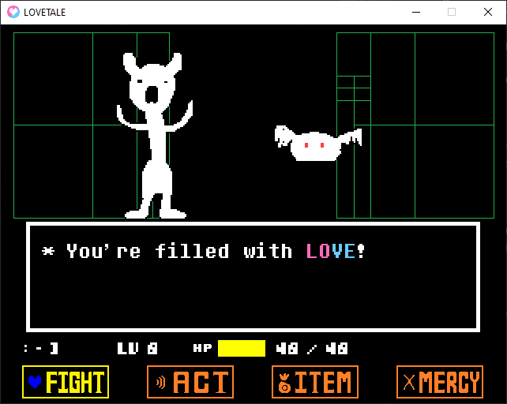

## LÖVETALE Engine

My third attempt at writing an Undertale battle engine in LÖVE with a goal of providing an easy framework for anyone to make their own accurate fanmade battles.

### Progress

This engine is still being worked on and is not finished. Here's a basic list of what is and isn't finished:

- FIGHTing is being worked on, but is not finished. Basic functionality is there but polish and accuracy improvements are needed. (Any help with this would be greatly appreciated!! Especially with programming in the enemy dust animation.)

- ACTing is completely finished.

- ITEMs are completely finished, besides item specific effects such as the Sea Tea's speed increase and item specific consumption sounds. I don't think these are important enough to work on right now, but later on I might work on putting those in.

- MERCY is completely finished, besides the particle effect that shows up when you spare an enemy.

- Enemy attacks have been started, but aren't a big priority until I've fully finished progamming FIGHTing. Things such as player damage and game over don't exist yet.

### Credits

I'm the only person working on this engine, but I used stuff from these cool people!

[92q6](https://github.com/92q6) - A friend of mine who I stole some code from. 
[Davidobot's post on the LOVE2D forums](https://love2d.org/forums/viewtopic.php?p=199030&sid=5e50e42e22e4538ca0f3f7b0717aa2f2#p199030) - FPS Limiter.  
[Toby Fox](https://x.com/tobyfox) - Developer of UNDERTALE, also the composer of Stronger Monsters.  
[Temmie Chang](https://x.com/tuyoki) - Developer of UNDERTALE.  

My Discord username is @sawby08 if you need anything or if you're willing to offer help!
