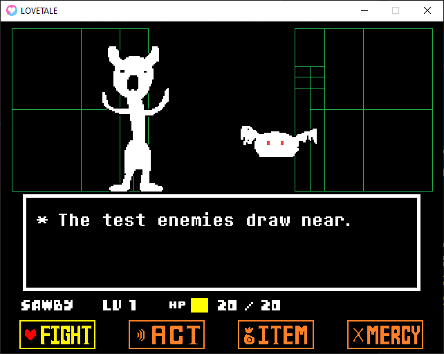
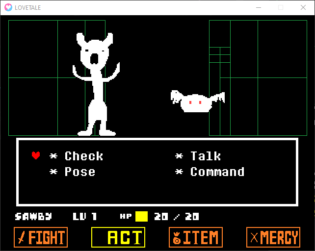
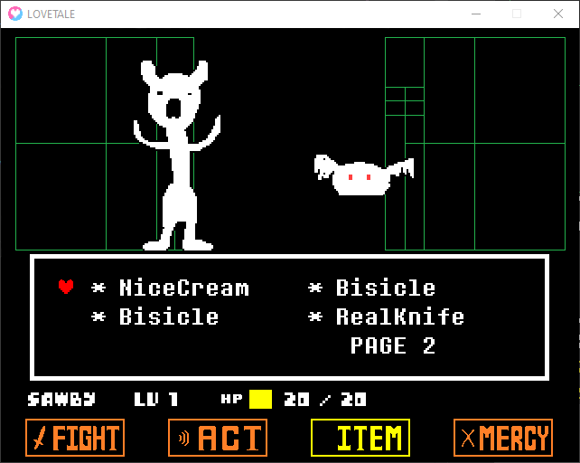
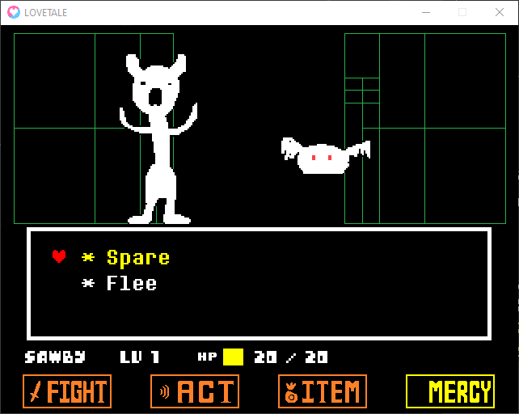
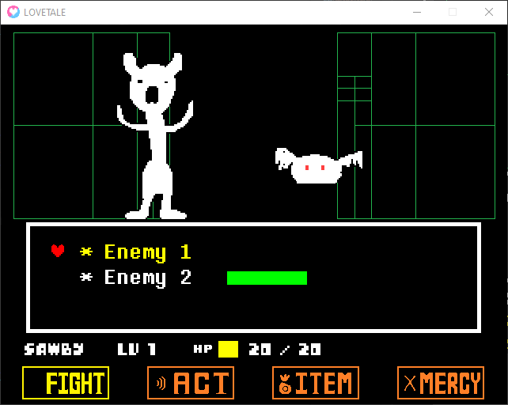
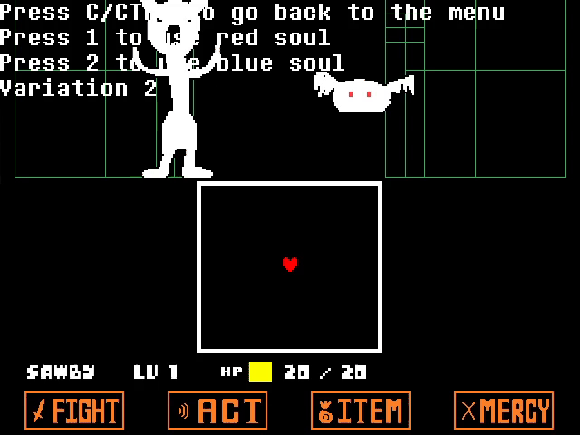
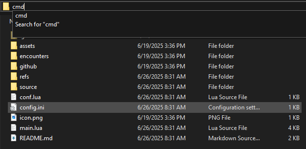

# LÖVETALE Engine

My third attempt at writing an Undertale battle engine in LÖVE with a goal of providing an easy framework for anyone to make their own accurate fanmade battles. Everything you need is in the "encounters" folder!

[Gamejolt Page](https://gamejolt.com/games/lovetale/1000844)

## Controls
- Move - ↑←↓→ / WASD
- Confirm - Z / Enter
- Cancel - X / Shift
- Menu - C / Control
- Pause - Escape
- Fullscreen - F4 or F

These are customizable in the `config.ini` file, as well as the enemy spare color, hitbox lenience, FPS, the usage of borders, and more.

## Notes
- This engine isn't compatible with love.js.
    - The FPS limiter I use modifies love.run() which probably isn't supported by the program.
        - I was previously using an FPS limiter that supported love.js (which allowed for testing the engine in the web atrols  least) but it made the controls feel a little weird so I switched back.
    - I think the state manager has some compatibility issues, too? It probably has something to do with constant love.load() calls but honestly I can't be bothered to make it completely compatible.
- The ACT and ITEM menu controls aren't one-to-one to the original game. I couldn't find a way to make it accurate while not having it hard-coded so they control a little differently.
    - Because of this, the ITEM menu supports unlimited pages!

## Credits

I'm the only person working on this engine, but I used stuff from these cool people!

[92q6](https://github.com/92q6) - Awesome friend that I exchange programming ideas with. 
[emir4169](https://github.com/emir4169) - Pull requests on my older engine that inspired some coding methods on this one.  
[Davidobot's post on the LOVE2D forums](https://love2d.org/forums/viewtopic.php?p=199030&sid=5e50e42e22e4538ca0f3f7b0717aa2f2#p199030) - FPS Limiter.  
[Toby Fox](https://x.com/tobyfox) - Developer of Undertale, also the composer of Stronger Monsters.  
[Temmie Chang](https://x.com/tuyoki) - Developer of Undertale.  

My Discord username is @sawby08 if you need anything or if you're willing to offer help!

## How to Run

I assume you already know how to do this but I thought I'd make these just in case! An easy way to run this engine is to:

- Install [LÖVE](https://love2d.org/)
- Zip the engine.
    - If you see an error talking about not being able to find main.lua, you didn't zip it correctly. Make sure main.lua is at the root of the .zip file.
- Change the file extention from .zip to .love.
- Double click the file.

The engine should now be running! Instructions for only avaliable for Windows and Linux because those are the only two OSes I have access to. Sorry!

Optionally, you can load the engine's directory in Visual Studio Code and run it through an extension. I use [this one](https://marketplace.visualstudio.com/items?itemName=pixelbyte-studios.pixelbyte-love2d).

### Windows

1. Open up the command prompt and set the directory as the directory of this engine.

    - An easy way to do this is to click on the directory entry on the top of the File Explorer and enter "cmd."

    

2. Run the command `"C:\Program Files\LOVE.exe" ./` (C:\Program Files\LOVE.exe can be wherever you installed LÖVE)

### Linux (Debian-based Distros)

1. Open up a terminal and install LÖVE: `sudo apt install love`
2. Go to the engine's directory and run `love ./`

### Linux (Arch-based Distros)

1. Open up a terminal and install LÖVE: `sudo pacman -S love`
2. Go to the engine's directory and run `love ./`